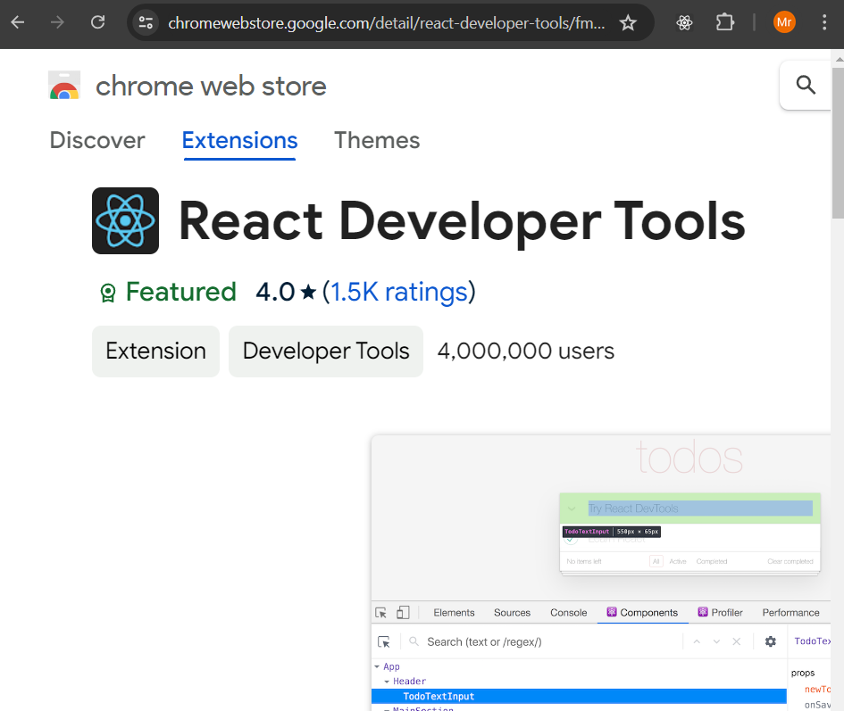

## Why React?

- For SPAs: React is ideal for creating highly interactive and dynamic user interfaces with a heavy reliance on JavaScript.
- For MPAs: React can be used selectively to improve specific components or sections, allowing for incremental enhancement and interoperability with existing technologies.

## What is React?

- It is a UI library focused on creating components.
- It uses a component-based approach for elements like the sidebar, header, and footer.

## Why Component?

- Simple structure :- It has a simple and easy-to-understand structure.
- Easy to reuse and update: create once, change once


- In React, any component is essentially a combination of HTML, CSS, and JavaScript.
-  React combines the HTML-like syntax and JavaScript to create JSX, a syntax extension that allows you to write HTML elements directly within JavaScript code.
- JSX makes it easier to create and manage the UI by allowing you to write markup directly in your JavaScript files.


## Installation

1. CRA :- Its a tool chain , help to install react easily for using this tool we need node js and command that can run with node .
2. Node.js provides the runtime environment necessary for React development, and CLI tools facilitate the installation, management, and execution of React applications and related dependencies. This combination forms the foundation for building modern, scalable web applications with React.

```javascript
>>> npx create-react-app my-app
```
npx: A Node.js package runner used to execute packages from the npm registry without needing to install them globally.
create-react-app: The toolchain for setting up a new React application.

This command sets up a new React project named my-app and automatically installs a development server and other necessary dependencies. React itself is based on Node.js, so the installation includes Node.js-related tools.


Note:- vite, parcel are other tool chain to install react.

Note:- Install (React-developer-tool) in chrome , and set it and when ever you visit any react site it will shine.





```javascript
>>> npm start
```


To start your React app using CRA, you can access it via:

1. Local Server:

```javascript

http://localhost:3000

```

2. On Your Network:


```javascript

http://192.128.1.3:3000

```

These URLs allow you to access your React application locally and on your network, respectively, after starting the development server with "npm start" or "yarn start".


## Index.html 


In a single-page application, this is the singular page where our React application will be attached.

## Error

Whenever you delete a file, React will show an error because it can't find the reference to that file anymore.

```javascript
>>> CTRL + Click to file 
```


## NPM start

"start" is a script defined in package.json that specifies the command to start your application.
It's commonly used for starting development servers, running build processes, or initiating any necessary tasks to launch your application.

```javascript
{
  "name": "my-react-app",
  "version": "1.0.0",
  "private": true,
  "dependencies": {
    "react": "^17.0.2",
    "react-dom": "^17.0.2",
    "react-scripts": "4.0.3"
  },
  "scripts": {
    "start": "react-scripts start",
    "build": "react-scripts build",
    "test": "react-scripts test"
  },
  "eslintConfig": {
    "extends": [
      "react-app",
      "react-app/jest"
    ]
  },
  "browserslist": {
    "production": [
      ">0.2%",
      "not dead",
      "not op_mini all"
    ],
    "development": [
      "last 1 chrome version",
      "last 1 firefox version",
      "last 1 safari version"
    ]
  }
}

```


```javascript

  "scripts": {
    "start": "react-scripts start",
    "build": "react-scripts build",
    "test": "react-scripts test"
  }

```
With "npm" you can run any script.

```javascript
>>> npm run start
Its a special case
>>> npm start


>>> npm run build
>>> npm run test
```


