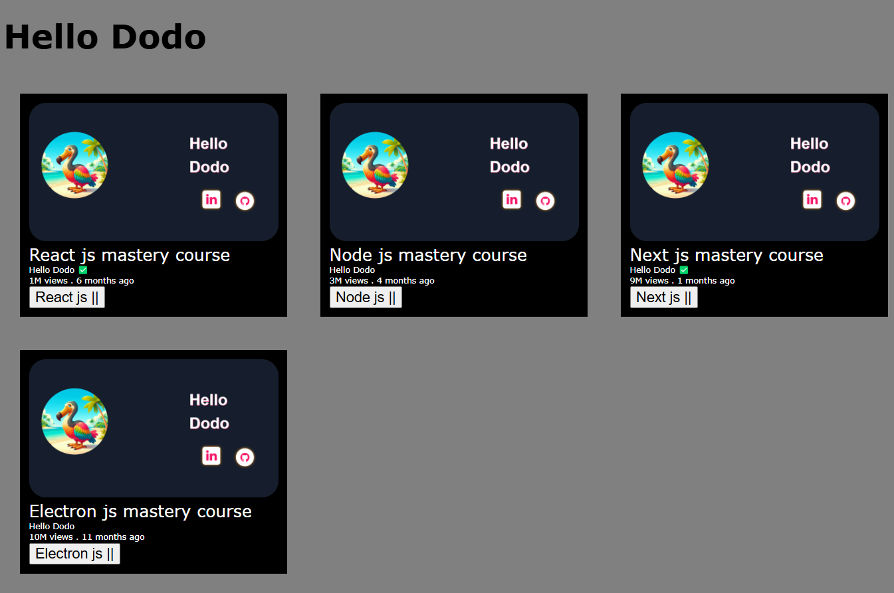

# Chapter 4 ( adding interactivity)


```javascript
function PlayButton() {
  return <button onClick={console.log("play")}>Play</button>;
}
```
correct

```javascript

function PlayButton() {
  return <button onClick={() => console.log("play")}>Play</button>;
}

```

or

```javascript

function PlayButton() {
  function handleClick() {
    console.log("play");
  }
  return <button onClick={handleClick}>Play</button>;
}

```

Note:- `onClick` is an event handler.
- Do not invoke the function directly; only define it.
- If the function is invoked directly, it will execute during the rendering phase instead of on the button click.


### Bothe the name of button and message of console is hard coded , make it dynamic with prop


```javascript
function PlayButton({ message, name }) {
  function handleClick() {
    console.log(message);
  }
  return <button onClick={handleClick}>{name}</button>;
}


 <PlayButton message={"play button clickd"} name={"play"} />
 <PlayButton message={"pause button clickd"} name={"pause"} />
```


or  pass children prop


```javascript
function PlayButton({ message, children }) {
  function handleClick() {
    console.log(message);
  }
  return <button onClick={handleClick}>{children}</button>;
}


 <PlayButton message={"play button clickd"}>Play</PlayButton>
<PlayButton message={"pause button clickd"}>Pause</PlayButton>
```


### both play and pause is running same function , but we want to run play function on click of play button and with pause a pause function. (passing function as prop)


```javascript
 <PlayButton message={"play button clickd"} onClick={"new prop"}>Play</PlayButton>
```

Note :- onClick here work as `prop`


we are passing function defination as prop and calling it at the Playbutton component `prop` 


```javascript
function PlayButton({ message, children, onClick }) {
  function handleClick() {
    onClick();
  }
  return <button onClick={handleClick}>{children}</button>;
}


 <PlayButton
        message={"play button clickd"}
        onClick={() => console.log("Abhinish ")}
      >
        Play
      </PlayButton>

      <PlayButton
        message={"pause button clickd"}
        onClick={() => console.log("Kumar ")}
      >
        Pause
      </PlayButton>

```

### Run different functions on a single button with custom event (play,pause)

```javascript

function PlayButton({ message, children, onPlay, onPause }) {
  let playing = true;
  function handleClick() {
    if (playing) onPlay();
    else onPause();

    playing = !playing;
  }
  return <button onClick={handleClick}>{children}</button>;
}


      <PlayButton
        message={"play button clickd"}
        onPlay={() => console.log("Play ")}
        onPause={() => console.log("Pause ")}
      >
        Play
      </PlayButton>

```

### WHy it does not change vlue of dom in button

```javascript

function PlayButton({ message, children, onPlay, onPause }) {
  let playing = true; //dont use
  function handleClick() {
    if (playing) onPlay();
    else onPause();

    playing = !playing;
  }
  return (
    <button onClick={handleClick}>
      {children} {playing ? "pause" : "play"}
    </button>
  );
}


<PlayButton
        message={"play button clickd"}
        onPlay={() => console.log("Play ")}
        onPause={() => console.log("Pause ")}
      >
        Play
 </PlayButton>

```


Only `state` can change the dom ui. 


### Pass button in every video with children prop.

```javascript
import React from "react";
import Video from "./Video";
import "./App.css";
import videos from "./data.js";

function PlayButton({ message, children, onPlay, onPause }) {
  let playing = true;
  function handleClick(e) {
    //e here is a event object
    //prevent event propagation
    e.stopPropagation();
    //stop default behaviour like submit
    e.preventDefault();
    if (playing) onPlay();
    else onPause();

    playing = !playing;
  }
  return (
    <button onClick={handleClick}>
      {children} {playing ? "||" : ">"}
    </button>
  );
}

function App() {
  return (
    <>
      <h1>Hello Dodo</h1>

      {/* <PlayButton
        message={"pause button clickd"}
        onClick={() => console.log("Kumar ")}
      >
        Pause
      </PlayButton> */}
      <div className="main-body">
        {videos.map((video) => {
          return (
            <Video
              key={video.id}
              title={video.title}
              bgColor={video.bgColor}
              channel={video.channel}
              views={video.views}
              time={video.time}
              verified={video.verified}
            >
              <PlayButton
                message={"play button clickd"}
                onPlay={() => console.log("Play " + video.title)}
                onPause={() => console.log("pause " + video.title)}
              >
                {video.title}
              </PlayButton>
            </Video>
          );
        })}
      </div>
    </>
  );
}

export default App;

```


```javascript
import "./Video.css";
import img from "./image.png";
function Video({ title, channel, views, time, verified, children }) {
  return (
    <div className="container" key={title}>
      <div className="pic">
        
      </div>

      <div>{title} mastery course</div>

      <div className="channel">
        {channel} {verified ? "✅" : null}{" "}
      </div>
      {/* <div className="channel">
        {channel} {verified && "✅"}
      </div> */}

      <div className="views">
        {views} views <span>.</span> {time}
      </div>
      <div>{children}</div>
    </div>
  );
}

export default Video;

```


Every video has its own separate button with separate functionality.




